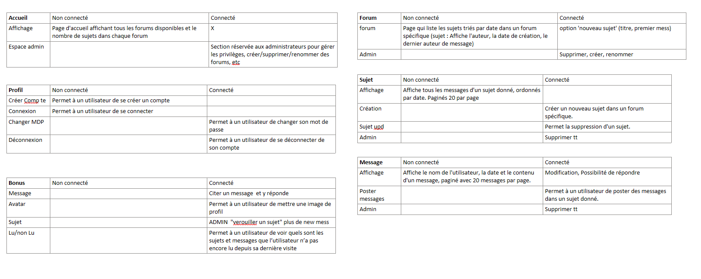

# Projet Forum

## Membres :
 - Quentin FLAGEOLLET
 - Stanislas JEANGEY
 - Antonin ROBERT

## Ressources :

### Routes API : 

GET : 
- **/users/ID | Login**
- **/users**
- **/forums/ID**
- **/forums**
- **/sujet/ID**
- **/sujets**
- **/messages/ID**
- **/message**
- **/forums/ID/sujets/**
- **/sujets/ID/messages**

POST :
- /users/ID
- /forums/ID
- /sujets/ID
- /messages/ID

PUT :
- **/users**
- /forum
- **/sujet**
- /messages

DELETE :
- /forum/ID
- /sujet/ID
- /messages/ID

### Lien du projet :  
**Lien vers l'appli :** [http://localhost:3000/](http://localhost:3000/)  
**Lien vers adminer :** [http://localhost:8080/](http://localhost:8080/)

## Setup for dev :

Après le git clone du projet, exécuter les commandes suivantes pour lancer le projet en mode développement :

```bash
docker compose up -d
```
```bash
cd src
```
```bash
npm i
```
```bash
npm run dev
```

## Informations de connexion BD :

- **Host** : `db` pour les conteneurs ou `localhost` pour la machine hôte
- **Port** : `3306`
- **User** : `user`
- **Password** : `password`
- **Database** : `forum`

### Importation de la base de données dans PHPStorm

```
#DataSourceSettings#
#LocalDataSource: base forum
#BEGIN#
<data-source source="LOCAL" name="base forum" uuid="643a87c9-a69b-48f5-8b55-89793eec0563"><database-info product="MariaDB" version="11.3.2-MariaDB-1:11.3.2+maria~ubu2204" jdbc-version="4.2" driver-name="MariaDB Connector/J" driver-version="3.0.7" dbms="MARIADB" exact-version="11.3.2" exact-driver-version="3.0"><extra-name-characters>#@</extra-name-characters><identifier-quote-string>`</identifier-quote-string></database-info><case-sensitivity plain-identifiers="mixed" quoted-identifiers="mixed"/><driver-ref>mariadb</driver-ref><synchronize>true</synchronize><jdbc-driver>org.mariadb.jdbc.Driver</jdbc-driver><jdbc-url>jdbc:mariadb://localhost:3306/forum</jdbc-url><secret-storage>master_key</secret-storage><user-name>user</user-name><schema-mapping><introspection-scope><node kind="schema" qname="@"/></introspection-scope></schema-mapping><working-dir>$ProjectFileDir$</working-dir></data-source>
#END#
```

## Description du projet :

